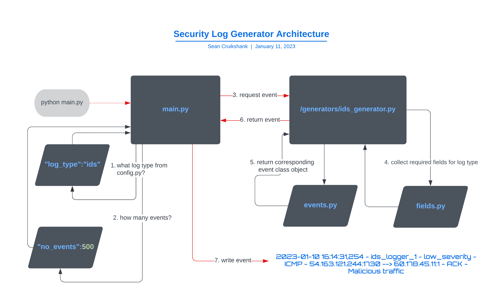
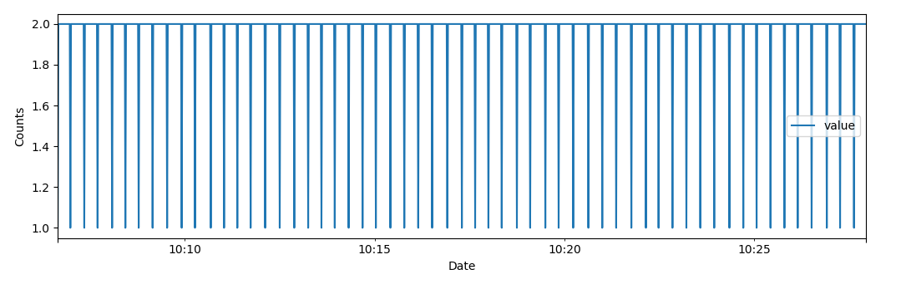
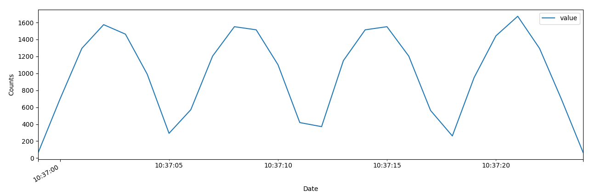

# Security Log Generator
 

## Features
- Generates simulated events for log formats that would typically be found in a SOC.
- As of 31st January 2023, it supports IDS, Web Access and Endpoint log formats.
- Can generate a specific number of events in a linear fashion or use a waveform to add 'bumpiness' to your data.
- In the future, the following log formats are planned to be added:
    - Windows event logs
    - Linux event logs
    - Perimeter device logs (firewalls, vpns, proxies etc)
    - Feel free to add an issue to the project if you require an additional format not listed
- The code is modular and extensible, adding additional formats can be done with relative ease. 

## Architecture

## Requirements
- A Python installation above Version 3.7+
- install libraries with pip: 
(currently the only dependency is Faker - https://pypi.org/project/Faker/)
~~~
pip install -r requirements.txt
~~~

## Configuration

- Edit the following values directly in the config.py file.
- The configuration parameters can be divided as follows:

###### - General Parameters: 
- log_type: this defines what type of log to produce.
    - takes values of:
    - access
    - ids
    - endpoint
- event_distribution: defines how to distribute events over time.
    - takes values of:
    - linear 
    - wave

###### - Linear Distribution Parameters:
- no_events: defines the number of events to generate.
    - you can specify any integer here.
- write_time: defines how long it takes to write a particular event.
    - you can specify a float or an integer here.

###### - Wave Distribution Parameters:
- frequency:
    - number of ossicilations within a time slice, the higher the value the more bumps and troughs.
- amplitude:
    - the strength of the wave, correlates to the max value on the Y axis, corresponds to how many events will be generated.
- sample_rate:
    - how many samples to take per time slice, corresponds to how many events will be generated per time slice.
- duration:
    - represents how long a wave lasts, in this program, 1 duration will produce 1 wave (if frequency is 1).
- stretch: 
    - similar to the 'write_time' for a linear distribution but for a 'duration' 
    - for example, if you have a 'duration' value of 2 and a 'stretch' value of 10
    - you can expect the program to take 20 odd seconds to complete its event generation.

###### - Valid Linear Distribution Configuration Example:
- A valid linear distribution configuration could look like this:
~~~
config = {
    "logging_level":"INFO",
    # General Parameters (applies first)
    "log_type":"ids",
    "event_distribution": "linear",
    # Linear Distribution Parameters (only applies if linear distribution)
    "no_events":2500,
    "write_time":0.5,
    # Wave Distribution Parameters (only applies if wave distribution)
    "frequency": 'n/a',
    "amplitude": 'n/a',
    "sample_rate": 'n/a',
    "duration": 'n/a',
    "stretch": 'n/a'
}
~~~

- your event distribution for the above config would look something like this:

###### - Valid Wave Distribution Configuration Example:
- A valid wave distribution configuration could look like this:

~~~
config = {
    "logging_level":"INFO",
    # General Parameters (applies first)
    "log_type":"ids",
    "event_distribution": "wave",
    # Linear Distribution Parameters (only applies if linear distribution)
    "no_events":500,
    "write_time":0.25,
    # Wave Distribution Parameters (only applies if wave distribution)
    "frequency": 1,
    "amplitude": 100,
    "sample_rate": 200,
    "duration": 2,
    "stretch": 10
}
~~~

- Your event distribution for the above config would look something like this:

###### - Wave Generator Benchmarks
- As the configuration of wave distribution can be quite complex, I've provided some benchmarks for the number of events generated
and how long it takes to run in seconds to give some hints towards the expected behaviour based on testing. 

- Generally, I would recommend low 'frequency' + 'duration' values and higher 'stretch' values to create a more smooth distribution.

| Amplitude | Frequency | Sample Rate | Duration | Events Generated | Time Taken (s) | No. of Waves | 
| :---: | :---: | :---: | :---: | :---: | :---: | :---: |
| 10 | 1 | 100 | 1 | 636 | 10.8 | 1 | 
| 20 | 1 | 100 | 1 | 1284 | 10.8 | 1 | 
| 30 | 1 | 100 | 1 | 1908 | 10.8 | 1 |
| 10 | 2 | 100 | 1 | 640 | 10.8 | 2 |
| 10 | 3 | 100 | 1 | 636 | 10.8 | 3 |
| 10 | 4 | 100 | 1 | 640 | 10.8 | 2 |
| 10 | 1 | 200 | 1 | 636 | 10.8 | 1 |
| 10 | 1 | 400 | 1 | 2552 | 12.38 | 1 |
| 10 | 1 | 800 | 1 | 5100 | 12.3 | 1 |
| 10 | 1 | 100 | 2 | 1272 | 21 | 2 |
| 10 | 1 | 100 | 3 | 1908 | 32.5 | 3 |
| 10 | 1 | 100 | 4 | 2544 | 43.43 | 4 |
| 100 | 6 | 1200 | 10 | 764,400 | 185.7 | many | 
| 200 | 4 | 600 | 40 | 3,056,000 | 743.14 | many |
| 100 | 1 | 600 | 40 | 1,528,480 | 742.86 | many |
| 100 | 1 | 100 | 40 | 254,720 | 433.17 | many |

## Run
- To run, simply run 'python main.py' in the terminal.
~~~
python main.py
~~~

## General Performance Expectations

All benchmarks tested on a 12th Gen Intel Core i5-12600K series CPU.

For linear distribution of events, the performance in terms of events written per second is tied to the `write_time` setting. Typically you can achieve the highest performance at low `write_time` settings (generally 0.01s) which is the time the program waits to write a new event. 

The maximum events per second can vary depending on the `log_type` setting. You can expect the following max eps based on the following log_types (if using a similar performance processor):

`ids` - 64 events per second

`access` - 15 events per second

`endpoint` - 26 events per second

Typically, each instance of the program would utilize around `7%` of the CPU on which this was tested. Therefore, there should be plenty of capacity to run multiple instances of the program simultaneously to achieve a higher `events per second` score. 

Tested performance benchmarks can be found in the `Benchmarks.xlsx` spreadsheet in the project root directory.

<em>general note - A lot of the performance will be tied not only to the randomness generators the program uses but some of the fundamental restrictions of Python itself. Effort is being made to increase performance for future versions however performance is not a high priority objective for this tool, rather the randomness and 'believability' of events generated. In many use cases, where generating a large number of events in quick succession is the goal, likely other tools will be much more suited to the task. 

Performance for waveform-based event generation i.e. `event_distribution: wave` has not yet been fully tested.
</em>
