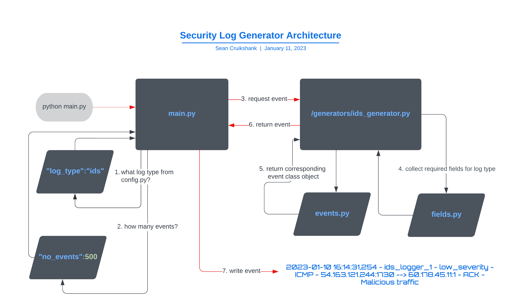

# Security Log Generator
 

## Features
- Generates simulated log events for log formats that would typically be found in a SIEM solution.
- As of 11th January 2023, it supports IDS and Web access log formats.
- In the future, the following log formats are planned to be added:
    - Windows event logs
    - Linux event logs
    - Perimeter device logs (firewalls, vpns, proxies etc)
    - Endpoint security logs
    - Feel free to add an issue to the project if you require an additional format not listed
- The code is modular and extensible, adding additional formats can be done with relative ease. 

## Architecture

## Requirements
- A Python installation above Version 3.7+
- install libraries with pip: 
(currently the only dependency is Faker - https://pypi.org/project/Faker/)
~~~
pip install -r requirements.txt
~~~

## Configuration
- There are three main configuration parameters:
    - no_events : this defines the number of events to produce
    - write_time : this defines how long it takes to write an event (in milliseconds)
    - log_type : this defines what type of log to produce
- You edit these values directly in the config.py file.
- An example valid configuration could look like this:
~~~
config = {
    "logging_level":"INFO",
    "no_events":500,
    "write_time":0.25,
    "log_type":"ids",
}
~~~
- for 'log_type', the current valid values are 'ids' and 'access'. 

## Run
- To run, simply run 'python main.py' in the terminal.
~~~
python main.py
~~~
